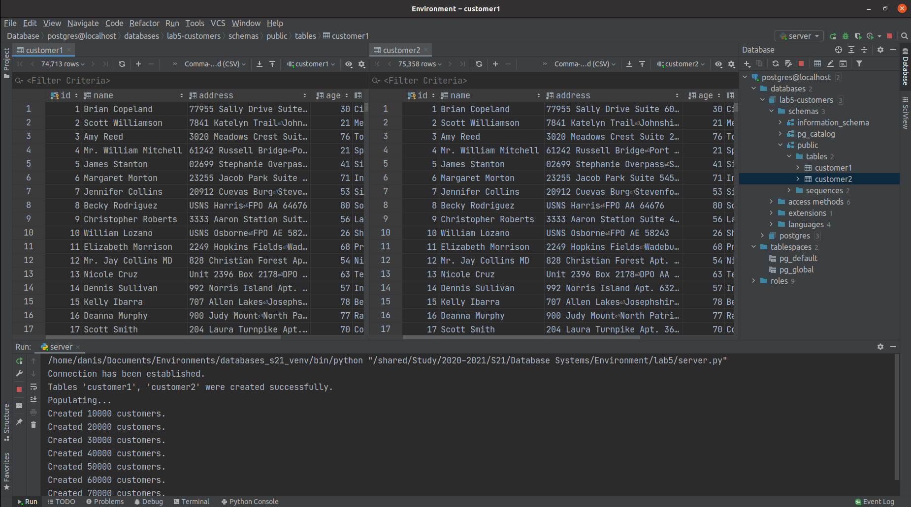
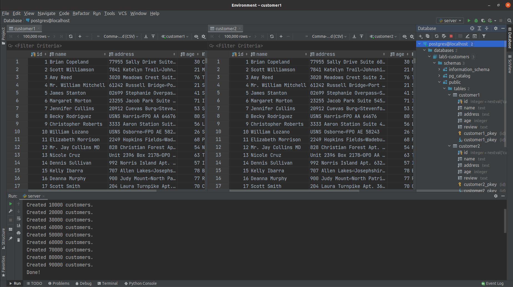
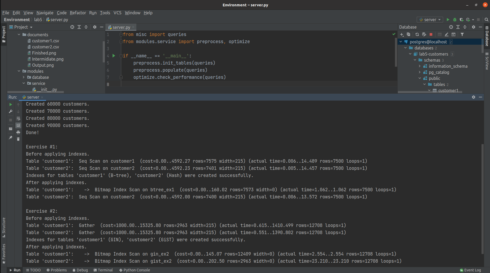

## Report for the Home Assignment - Week 5.

### Populating the tables:

Tables were populated using the function `populate()` inside the file [preprocess.py](modules/service/preprocess.py). \
As in the example proposed in lab this project utilizes `Faker` package to create fake data. \
In the following screenshots depicted process of populating tables and first several rows in both tables. \
 \
\


### Queries:

The created queries are aggregated in class and available in the file [queries.py](modules/service/queries.py). \
\
<b>Preliminaries.</b>\
There were created tables `customer1` and `customer2` using [database.sql](modules/service/database.sql). Then in the
mentioned above function `populate()` there iteratively executed `INSERT` queries for both tables: \
`INSERT INTO customer1(name, address, age, review) VALUES (%s, %s, %s, %s);` \
`INSERT INTO customer2(name, address, age, review) VALUES (%s, %s, %s, %s);`\
where placeholders `%s` allow inserting data using psycopg2 package. \
\
<b>Exercise 1.</b>\
For tables `customer1` and `customer2` there were created two indexes for the attribute (column) `age` based on B-tree
and Hashing correspondingly: \
`CREATE INDEX btree_ex1 ON customer1 USING BTREE (age);` \
`CREATE INDEX hash_ex1 ON customer2 USING HASH (age);` \
In order to explore the efficiency of indexes there were executed following queries: \
`EXPLAIN ANALYZE SELECT * FROM customer1 WHERE age >= 18 AND age <= 22;` \
`EXPLAIN ANALYZE SELECT * FROM customer2 WHERE age >= 18 AND age <= 22;`\
which retrieve all customers whose age is in range of [18, 22] years.\
\
<b>Exercise 2.</b>\
For tables `customer1` and `customer2` there were created two indexes for the attribute (column) `review` based on GIN
and GiST correspondingly:\
`CREATE INDEX gin_ex2 ON customer1 USING GIN (to_tsvector('english', review));` \
`CREATE INDEX gist_ex2 ON customer2 USING GIST (to_tsvector('english', review));`\
In order to explore the efficiency of indexes there were executed following queries: \
`EXPLAIN ANALYZE SELECT * FROM customer1 WHERE to_tsvector('english', review) @@ to_tsquery('english', 'media | conference | camera | economic | company | cost');` \
`EXPLAIN ANALYZE SELECT * FROM customer2 WHERE to_tsvector('english', review) @@ to_tsquery('english', 'media | conference | camera | economic | company | cost');`\
which retrieve all customers whose review contains words "media", "conference", "camera", "economic", "company", "cost".

### Sample output:

``` 
$ python server.py

Connection has been established.
Tables 'customer1', 'customer2' were created successfully.
Populating...
Created 10000 customers.
Created 20000 customers.
Created 30000 customers.
Created 40000 customers.
Created 50000 customers.
Created 60000 customers.
Created 70000 customers.
Created 80000 customers.
Created 90000 customers.
Done!

Exercise #1: 
Before applying indexes.
Table 'customer1':  Seq Scan on customer1  (cost=0.00..4589.85 rows=7578 width=215) (actual time=0.006..14.030 rows=7531 loops=1)
Table 'customer2':  Seq Scan on customer2  (cost=0.00..4589.80 rows=7394 width=215) (actual time=0.005..14.078 rows=7531 loops=1)
Indexes for tables 'customer1' (B-tree), 'customer2' (Hash) were created successfully.
After applying indexes.
Table 'customer1':  Bitmap Heap Scan on customer1  (cost=161.92..3364.51 rows=7573 width=215) (actual time=1.315..4.014 rows=7531 loops=1)
Table 'customer2':  Seq Scan on customer2  (cost=0.00..4589.00 rows=7390 width=215) (actual time=0.007..13.104 rows=7531 loops=1)

Exercise #2: 
Before applying indexes.
Table 'customer1':  Gather  (cost=1000.00..15322.80 rows=2963 width=215) (actual time=0.741..1376.895 rows=12533 loops=1)
Table 'customer2':  Gather  (cost=1000.00..15322.80 rows=2963 width=215) (actual time=0.717..1377.796 rows=12533 loops=1)
Indexes for tables 'customer1' (GIN), 'customer2' (GiST) were created successfully.
After applying indexes.
Table 'customer1':  Bitmap Heap Scan on customer1  (cost=74.96..4025.99 rows=2963 width=215) (actual time=2.856..6.206 rows=12533 loops=1)
Table 'customer2':  Bitmap Heap Scan on customer2  (cost=203.24..4154.27 rows=2963 width=215) (actual time=23.234..566.453 rows=12533 loops=1)
```

The screenshot of output in PyCharm:

